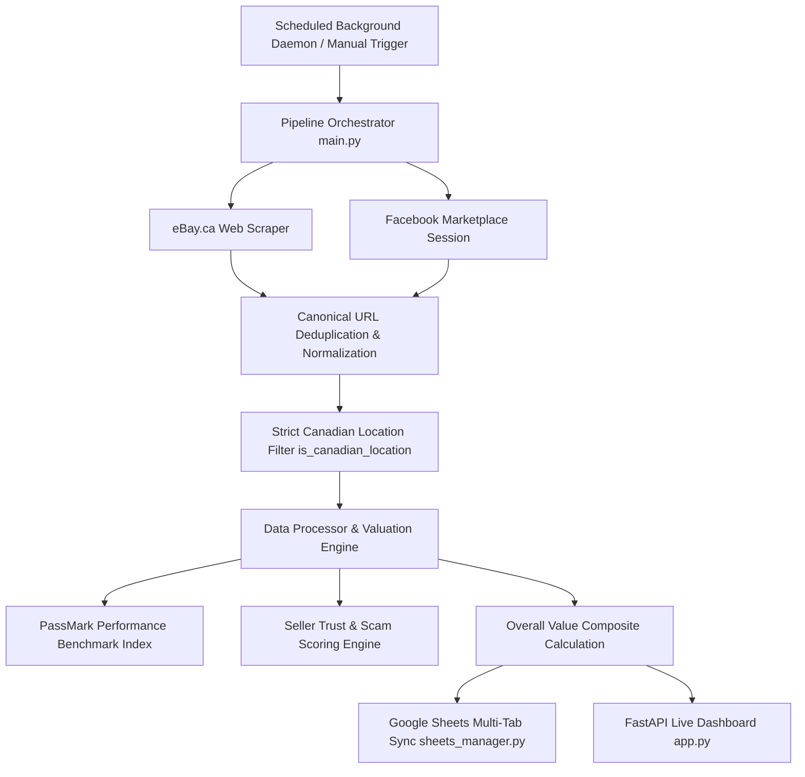

# PC Parts Auto Researcher (CPU & RAM)

[](https://www.python.org/downloads/)
[](https://fastapi.tiangolo.com/)
[](https://opensource.org/licenses/MIT)

Autonomous search engine, valuation analyzer, and live dashboard that discovers, evaluates, and tracks used **CPU** and **RAM** upgrades specifically compatible with the **Gigabyte GA-H110-D3A** motherboard (LGA1151 socket, Intel H110 chipset, 2x DDR4 UDIMM slots) in **Newmarket, ON, Canada (`L3Y 8B4`)** and surrounding regions.

---

## 🚀 Key Features

- **🌐 Multi-Source Dual Scraper**: Scrapes listings across **eBay.ca** (Local Pickup + Canadian proximity) and **Facebook Marketplace** (20km radius of Newmarket, ON) with zero external API key requirements.
- **🍁 100% Verified Canadian Origin Filtering**: Inspects explicit `Located in: <Location>` and `Item location:` data, eliminating international dropshippers from China, the US, and overseas.
- **⚡ Hardware Performance Benchmarking**: Maps every compatible CPU to its established **PassMark Multi-Core Benchmark Rating** (up to 9,700 pts on i7-7700K) and calculates performance-per-dollar efficiency.
- **🛡️ Nuanced Seller Trust & Scam Detection**:
  - Calculates a **Seller Trust Score (0–100 pts)** based on positive feedback %, lifetime sales volume, and tested working condition.
  - Automatically disqualifies clickbait prices ($0, $1, $123), "box only" listings, and 0-feedback extreme discounts.
- **📍 Local 20km Radar**: Dedicated tracking for in-person local pickups in **Newmarket, Aurora, Bradford, East Gwillimbury, King City, Keswick, Stouffville, and Richmond Hill**.
- **📑 Multi-Tab Google Sheets Integration**: Syncs and organizes listings across 10 specialized worksheet tabs with automated deduplication and sorting.
- **🖥️ Live Updating Web Dashboard**: Built with FastAPI, Vanilla CSS, and JavaScript featuring real-time auto-polling, dynamic search, multi-model filtering, and on-demand scan triggers.

---

## 🎯 Target Hardware Compatibility Specifications

Designed specifically for the **Gigabyte GA-H110-D3A-CF** motherboard:

| Component | Compatible Specifications | Disqualified / Incompatible Hardware |
| :--- | :--- | :--- |
| **CPU** | **Intel 6th Gen (Skylake) & 7th Gen (Kaby Lake)**<br>&bull; Core i7-7700K, i7-7700, i7-7700T<br>&bull; Core i7-6700K, i7-6700, i7-6700T<br>&bull; Xeon E3-1200 v5 & v6 series (LGA1151) | &bull; 8th/9th Gen (i7-8700, i7-9700)<br>&bull; Non-LGA1151 sockets (LGA1150, LGA1200, LGA1700, AM4)<br>&bull; Core i3 / Core i5 / Pentium / Celeron |
| **RAM** | **Desktop DDR4 UDIMM Non-ECC (288-Pin)**<br>&bull; Single sticks: `1x8GB`, `1x16GB`<br>&bull; Dual-channel kits: `2x8GB` (16GB kit), `2x4GB` (8GB kit)<br>&bull; Speeds: 2133 MHz, 2400 MHz, 2666+ MHz | &bull; Laptop SODIMM (260-Pin)<br>&bull; Server ECC / Registered RDIMM / LRDIMM<br>&bull; DDR3 (240-Pin) / DDR5 (288-Pin) |

---

## 🏗️ Architecture Overview



---

## 📊 CPU Performance Benchmark Index

| Model | Cores / Threads | Base / Boost Clock | TDP | PassMark Rating | Upgrade vs Celeron G3900 |
| :--- | :---: | :---: | :---: | :---: | :---: |
| **Intel Core i7-7700K** | 4C / 8T | 4.20 GHz / 4.50 GHz | 91W | **9,700** | **4.4x Faster** |
| **Intel Xeon E3-1270 v6** | 4C / 8T | 3.80 GHz / 4.20 GHz | 72W | **9,400** | **4.3x Faster** |
| **Intel Core i7-6700K** | 4C / 8T | 4.00 GHz / 4.20 GHz | 91W | **8,900** | **4.0x Faster** |
| **Intel Core i7-7700** | 4C / 8T | 3.60 GHz / 4.20 GHz | 65W | **8,650** | **3.9x Faster** |
| **Intel Xeon E3-1240 v6** | 4C / 8T | 3.50 GHz / 3.90 GHz | 72W | **8,600** | **3.9x Faster** |
| **Intel Xeon E3-1270 v5** | 4C / 8T | 3.60 GHz / 4.00 GHz | 80W | **8,400** | **3.8x Faster** |
| **Intel Core i7-6700** | 4C / 8T | 3.40 GHz / 4.00 GHz | 65W | **8,100** | **3.7x Faster** |
| **Intel Core i7-7700T** | 4C / 8T | 2.90 GHz / 3.80 GHz | 35W | **7,200** | **3.3x Faster** |
| **Intel Core i7-6700T** | 4C / 8T | 2.80 GHz / 3.60 GHz | 35W | **6,700** | **3.0x Faster** |

---

## 🛠️ Quickstart & Installation

### 1. Clone the Repository
```bash
git clone https://github.com/StickwoodJr/used-pc-parts-auto-researcher.git
cd used-pc-parts-auto-researcher
```

### 2. Create Virtual Environment & Install Dependencies
```bash
python3 -m venv .venv
source .venv/bin/activate
pip install -r requirements.txt
playwright install chromium
```

### 3. Run Automated Tests
```bash
pytest -v
```

### 4. Run Search Pipeline
```bash
# Run full live search and sync to Google Sheets
python main.py

# Run in dry-run mode (read-only)
python main.py --dry-run
```

### 5. Launch Live Updating Web Dashboard
```bash
uvicorn app:app --host 0.0.0.0 --port 8000
```
Open **`http://localhost:8000`** in your browser to view the real-time interactive dashboard.

---

## 📑 Google Sheets Multi-Tab Workbook

When configured with `service_account.json`, the tracker maintains a 10-tab Google Sheet titled **`PC Parts Search - CPU & RAM`**:

1. **🏆 Master Summary**: Cross-model Top 5 Overall CPUs Leaderboard + Per-model breakdowns + Top 5 RAM.
2. **📍 Local Summary (20km)**: Listings within 20km of Newmarket, ON (Aurora, Bradford, EG, etc.).
3. **📌 CPU - i7-6700**: Ranked Core i7-6700 listings.
4. **📌 CPU - i7-6700K**: Ranked Core i7-6700K listings.
5. **📌 CPU - i7-6700T**: Ranked Core i7-6700T (35W) listings.
6. **📌 CPU - i7-7700**: Ranked Core i7-7700 listings.
7. **📌 CPU - i7-7700K**: Ranked Core i7-7700K listings.
8. **📌 CPU - i7-7700T**: Ranked Core i7-7700T (35W) listings.
9. **📌 CPU - Xeon E3 v5-v6**: Ranked Xeon E3-1200 v5 & v6 series listings.
10. **📌 RAM - DDR4 UDIMM**: Ranked Desktop DDR4 UDIMMs.
11. **🗄️ Listings**: Complete raw archive of all tracked Canadian listings.

---

## 🔒 Privacy & Security

- **No Credential Storage**: All Facebook searches utilize an interactive persistent browser session without storing passwords.
- **Service Account Protection**: Google service account credentials and `.env` files are excluded by `.gitignore`.

---

## 📜 License

This project is licensed under the MIT License - see the [LICENSE](LICENSE) file for details.
